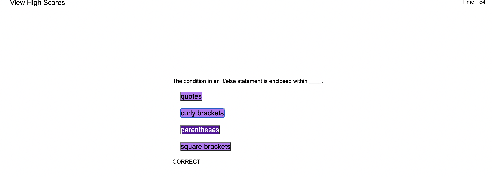

# Code Quiz

## Description
This short quiz will test your coding knowledge. Once you hit 'start', you will have a certain amount of time to answer the questions. Your score at the end is based on how much time is left, however getting an answer wrong will result in a ten second penalty.
You can save your scores to how high you can get. 

## screenshot

## Link

https://jeremybukofzer.github.io/code-quiz-challenge/